# OrionSoft Clean Architecture - Diagramas de Arquitectura

## 📋 Índice

1. [Modelo C4 - Context Diagram](#modelo-c4---context-diagram)
2. [Modelo C4 - Container Diagram](#modelo-c4---container-diagram)  
3. [Modelo C4 - Component Diagram](#modelo-c4---component-diagram)
4. [Diagramas de Secuencia](#diagramas-de-secuencia)
5. [Diagramas de Flujo](#diagramas-de-flujo)
6. [Diagramas de Clases](#diagramas-de-clases)
7. [Diagramas de Deployment](#diagramas-de-deployment)

## 🌐 Modelo C4 - Context Diagram

### Nivel 1: Contexto del Sistema

```mermaid
C4Context
    title Sistema OrionSoft - Contexto

    Person(admin, "Administrador del Sistema", "Usuario administrador que gestiona el sistema")
    Person(manager, "Manager", "Usuario con permisos de gestión de datos")
    Person(user, "Usuario Final", "Usuario estándar del sistema")
    Person(support, "Soporte Técnico", "Equipo de soporte para mantenimiento")

    System(orionsoft, "OrionSoft System", "Sistema de gestión empresarial con Clean Architecture")

    System_Ext(database, "Base de Datos", "SQL Server/MySQL/PostgreSQL para persistencia")
    System_Ext(logging, "Sistema de Logs", "Archivos de log con rotación automática")
    System_Ext(legacy, "Sistemas Legacy", "Sistemas existentes que consumen APIs")
    System_Ext(monitoring, "Monitoreo", "Herramientas de monitoreo y alertas")

    Rel(admin, orionsoft, "Administra usuarios y configuración", "RemObjects DataSnap")
    Rel(manager, orionsoft, "Gestiona datos del negocio", "RemObjects DataSnap") 
    Rel(user, orionsoft, "Usa funcionalidades del sistema", "RemObjects DataSnap")
    Rel(support, orionsoft, "Monitorea y mantiene", "Logs y métricas")

    Rel(orionsoft, database, "Lee y escribe datos", "FireDAC/SQL")
    Rel(orionsoft, logging, "Escribe logs estructurados", "Archivos")
    Rel(orionsoft, legacy, "Expone APIs compatibles", "RemObjects")
    Rel(orionsoft, monitoring, "Envía métricas", "Performance counters")

    UpdateRelStyle(admin, orionsoft, $textColor="blue", $lineColor="blue")
    UpdateRelStyle(manager, orionsoft, $textColor="green", $lineColor="green")  
    UpdateRelStyle(user, orionsoft, $textColor="orange", $lineColor="orange")
```



### Descripción del Contexto

- **Usuarios Principales**: 
  - Administradores: Configuración del sistema y gestión de usuarios
  - Managers: Supervisión y gestión de operaciones de negocio
  - Usuarios Finales: Operaciones cotidianas del sistema
  - Soporte Técnico: Mantenimiento y resolución de problemas

- **Sistemas Externos**:
  - Base de Datos: Almacenamiento persistente multi-proveedor
  - Logging: Sistema de logs estructurado con rotación
  - Legacy Systems: Integración con sistemas existentes
  - Monitoring: Supervisión proactiva del sistema

## 🏗️ Modelo C4 - Container Diagram

### Nivel 2: Contenedores del Sistema


### Descripción de Contenedores

- **OrionSoft Server**: Core de la aplicación con Clean Architecture
- **RemObjects DataSnap**: Capa de comunicación que expone APIs
- **DI Container**: Gestión centralizada de dependencias
- **File Logger**: Logging estructurado con rotación automática
- **Database**: Persistencia multi-proveedor (SQL Server/MySQL/PostgreSQL)

## ⚙️ Modelo C4 - Component Diagram

### Nivel 3: Componentes del OrionSoft Server

```mermaid
C4Component
    title OrionSoft Server - Component Diagram

    Container_Boundary(server, "OrionSoft Server") {
        Component(auth_service, "Authentication Service", "Application Layer", "Gestiona autenticación y autorización")
        Component(user_usecase, "User Use Cases", "Core Layer", "Casos de uso relacionados con usuarios")
        Component(user_entity, "User Entity", "Core Layer", "Entidad de dominio Usuario")
        
        Component(user_repo_interface, "IUserRepository", "Core Layer", "Interface del repositorio de usuarios")
        Component(logger_interface, "ILogger", "Core Layer", "Interface del sistema de logging")
        
        Component(sql_user_repo, "SQL User Repository", "Infrastructure Layer", "Implementación SQL del repositorio")
        Component(inmemory_user_repo, "InMemory User Repository", "Infrastructure Layer", "Implementación en memoria")
        Component(file_logger_impl, "File Logger", "Infrastructure Layer", "Implementación de logging a archivos")
        
        Component(di_container, "DI Container", "Infrastructure Layer", "Contenedor de inyección de dependencias")
        Component(db_connection, "DB Connection", "Infrastructure Layer", "Abstracción de conexión a base de datos")
        Component(remobjects_adapter, "RemObjects Adapter", "Application Layer", "Adaptador para compatibilidad legacy")
    }

    ContainerDb(database, "Database", "SQL Server/MySQL/PostgreSQL", "Base de datos")
    Container(datasnap, "RemObjects DataSnap", "RemObjects SDK", "Capa de comunicación")

    ' Core dependencies (interfaces only)
    Rel(user_usecase, user_repo_interface, "Usa", "Interface")
    Rel(user_usecase, logger_interface, "Usa", "Interface")
    Rel(user_usecase, user_entity, "Gestiona", "Domain Entity")
    Rel(auth_service, user_usecase, "Ejecuta", "Use Cases")

    ' Infrastructure implements interfaces
    Rel(sql_user_repo, user_repo_interface, "Implementa", "Interface")
    Rel(inmemory_user_repo, user_repo_interface, "Implementa", "Interface") 
    Rel(file_logger_impl, logger_interface, "Implementa", "Interface")
    
    ' Infrastructure dependencies
    Rel(sql_user_repo, db_connection, "Usa", "Database Access")
    Rel(db_connection, database, "Conecta", "FireDAC")
    
    ' DI Container wiring
    Rel(di_container, sql_user_repo, "Instancia", "Factory")
    Rel(di_container, file_logger_impl, "Instancia", "Factory")
    Rel(di_container, auth_service, "Resuelve", "Dependency")
    
    ' Presentation layer
    Rel(remobjects_adapter, auth_service, "Delega", "Service Call")
    Rel(datasnap, remobjects_adapter, "Llama", "Adapter Methods")

    UpdateLayoutConfig($c4ShapeInRow="4", $c4BoundaryInRow="2")
```

### Descripción de Componentes

#### Core Layer (Dominio)
- **User Entity**: Entidad principal del dominio con lógica de negocio
- **User Use Cases**: Casos de uso para gestión de usuarios
- **IUserRepository**: Interface para persistencia de usuarios  
- **ILogger**: Interface para sistema de logging

#### Application Layer (Aplicación)  
- **Authentication Service**: Servicio de autenticación y autorización
- **RemObjects Adapter**: Adaptador para compatibilidad con sistemas legacy

#### Infrastructure Layer (Infraestructura)
- **SQL User Repository**: Implementación de repositorio con base de datos SQL
- **InMemory User Repository**: Implementación en memoria para testing
- **File Logger**: Implementación de logging a archivos
- **DI Container**: Contenedor de inyección de dependencias
- **DB Connection**: Abstracción de conexión a base de datos

## 🔄 Diagramas de Secuencia

### Secuencia 1: Proceso de Autenticación

```mermaid
sequenceDiagram
    participant Client as Cliente
    participant DataSnap as RemObjects DataSnap
    participant Adapter as RemObjects Adapter
    participant AuthService as Authentication Service
    participant UseCase as Authenticate Use Case
    participant UserRepo as User Repository
    participant Database as Base de Datos
    participant Logger as Logger

    Client->>+DataSnap: Login(username, password)
    DataSnap->>+Adapter: AuthenticateUser(request)
    Adapter->>+AuthService: AuthenticateUser(request)
    
    AuthService->>+UseCase: Execute(request)
    
    Note over UseCase: Validar parámetros de entrada
    UseCase->>+Logger: Debug("Authentication attempt", context)
    Logger-->>-UseCase: OK
    
    UseCase->>+UserRepo: GetByUserName(username)
    UserRepo->>+Database: SELECT * FROM Users WHERE UserName = ?
    Database-->>-UserRepo: User Data
    UserRepo-->>-UseCase: User Entity
    
    Note over UseCase: Verificar credenciales
    alt Usuario válido y contraseña correcta
        UseCase->>+UserRepo: Save(user) // Actualizar último login
        UserRepo->>+Database: UPDATE Users SET LastLoginAt = NOW()
        Database-->>-UserRepo: OK
        UserRepo-->>-UseCase: OK
        
        UseCase->>+Logger: LogAuthentication(username, true)
        Logger-->>-UseCase: OK
        
        UseCase-->>-AuthService: Success Response
        AuthService-->>-Adapter: Success Response
        Adapter-->>-DataSnap: Success Response
        DataSnap-->>-Client: Session + User Info
        
    else Credenciales inválidas
        UseCase->>+UserRepo: Save(user) // Incrementar intentos fallidos
        UserRepo->>+Database: UPDATE Users SET FailedLoginAttempts++
        Database-->>-UserRepo: OK
        UserRepo-->>-UseCase: OK
        
        UseCase->>+Logger: LogAuthentication(username, false)
        Logger-->>-UseCase: OK
        
        UseCase-->>-AuthService: Failure Response
        AuthService-->>-Adapter: Failure Response  
        Adapter-->>-DataSnap: Failure Response
        DataSnap-->>-Client: Error Message
    end
```

### Secuencia 2: Creación de Usuario

```mermaid
sequenceDiagram
    participant Admin as Administrador
    participant DataSnap as RemObjects DataSnap
    participant Adapter as RemObjects Adapter
    participant UserService as User Service
    participant UserUseCase as Create User Use Case
    participant UserEntity as User Entity
    participant UserRepo as User Repository
    participant Database as Base de Datos
    participant Logger as Logger

    Admin->>+DataSnap: CreateUser(userData)
    DataSnap->>+Adapter: CreateUser(request)
    Adapter->>+UserService: CreateUser(request)
    
    UserService->>+UserUseCase: Execute(request)
    
    Note over UserUseCase: Validaciones de negocio
    UserUseCase->>+Logger: Info("Starting user creation", context)
    Logger-->>-UserUseCase: OK
    
    alt Datos válidos
        UserUseCase->>+UserRepo: IsUserNameTaken(username)
        UserRepo->>+Database: SELECT COUNT(*) FROM Users WHERE UserName = ?
        Database-->>-UserRepo: Count
        UserRepo-->>-UserUseCase: Boolean
        
        alt Username disponible
            UserUseCase->>+UserEntity: Create(id, username, email, ...)
            UserEntity-->>-UserUseCase: User Instance
            
            Note over UserEntity: Aplicar reglas de dominio
            UserUseCase->>+UserEntity: SetPassword(password)
            UserEntity->>UserEntity: Hash password + validaciones
            UserEntity-->>-UserUseCase: OK
            
            UserUseCase->>+UserRepo: Save(user)
            UserRepo->>+Database: INSERT INTO Users (...)
            Database-->>-UserRepo: OK
            UserRepo-->>-UserUseCase: True
            
            UserUseCase->>+Logger: LogBusinessRule("UserCreated", "User", userId, true)
            Logger-->>-UserUseCase: OK
            
            UserUseCase-->>-UserService: Success Response
            UserService-->>-Adapter: Success Response
            Adapter-->>-DataSnap: Success Response
            DataSnap-->>-Admin: Success + UserId
            
        else Username ya existe
            UserUseCase->>+Logger: LogBusinessRule("UniqueUsername", "User", "", false)
            Logger-->>-UserUseCase: OK
            
            UserUseCase-->>-UserService: Failure Response
            UserService-->>-Adapter: Failure Response
            Adapter-->>-DataSnap: Failure Response
            DataSnap-->>-Admin: Error: Username taken
        end
        
    else Datos inválidos
        UserUseCase->>+Logger: Warning("Invalid user data", context)
        Logger-->>-UserUseCase: OK
        
        UserUseCase-->>-UserService: Validation Error
        UserService-->>-Adapter: Validation Error
        Adapter-->>-DataSnap: Validation Error
        DataSnap-->>-Admin: Validation Error Details
    end
```

## 🔀 Diagramas de Flujo

### Flujo 1: Proceso de Autenticación

```mermaid
flowchart TD
    Start([Inicio: Solicitud de Login]) --> ValidateInput{Validar entrada}
    
    ValidateInput -->|Datos válidos| GetUser[Obtener usuario de BD]
    ValidateInput -->|Datos inválidos| ReturnValidationError[Retornar error de validación]
    
    GetUser --> UserExists{¿Usuario existe?}
    
    UserExists -->|No| LogFailedAttempt[Log: Usuario no encontrado]
    UserExists -->|Si| CheckActiveStatus{¿Usuario activo?}
    
    CheckActiveStatus -->|No| LogInactiveUser[Log: Usuario inactivo]
    CheckActiveStatus -->|Si| CheckBlocked{¿Usuario bloqueado?}
    
    CheckBlocked -->|Si| CheckBlockExpired{¿Bloqueo expiró?}
    CheckBlocked -->|No| VerifyPassword{Verificar contraseña}
    
    CheckBlockExpired -->|No| LogBlockedUser[Log: Usuario bloqueado]
    CheckBlockExpired -->|Si| UnblockUser[Desbloquear usuario] --> VerifyPassword
    
    VerifyPassword -->|Correcta| CheckPasswordExpired{¿Contraseña expirada?}
    VerifyPassword -->|Incorrecta| IncrementFailedAttempts[Incrementar intentos fallidos]
    
    IncrementFailedAttempts --> CheckMaxAttempts{¿Máximo de intentos?}
    CheckMaxAttempts -->|Si| BlockUser[Bloquear usuario] --> LogBlockedUser
    CheckMaxAttempts -->|No| LogFailedLogin[Log: Login fallido] --> ReturnAuthError[Retornar error de autenticación]
    
    CheckPasswordExpired -->|Si| RecordLogin[Registrar login exitoso] --> LogSuccessfulLogin[Log: Login exitoso] --> ReturnPasswordExpired[Retornar: contraseña expirada]
    CheckPasswordExpired -->|No| RecordLogin
    RecordLogin --> ResetFailedAttempts[Resetear intentos fallidos]
    ResetFailedAttempts --> GenerateSession[Generar sesión]
    GenerateSession --> LogSuccessfulLogin
    LogSuccessfulLogin --> ReturnSuccess[Retornar datos de sesión]
    
    LogFailedAttempt --> ReturnAuthError
    LogInactiveUser --> ReturnAuthError
    LogBlockedUser --> ReturnAuthError
    
    ReturnValidationError --> End([Fin])
    ReturnAuthError --> End
    ReturnPasswordExpired --> End
    ReturnSuccess --> End
```



### Flujo 2: Gestión de Errores y Logging

```mermaid
flowchart TD
    Error([Error/Excepción Capturada]) --> ClassifyError{Clasificar tipo de error}
    
    ClassifyError -->|Validation| ValidationError[EValidationException]
    ClassifyError -->|Authentication| AuthError[EAuthenticationException]
    ClassifyError -->|Authorization| AuthzError[EAuthorizationException]
    ClassifyError -->|Business Rule| BusinessError[EBusinessRuleException]
    ClassifyError -->|Database| DatabaseError[EDatabaseException]
    ClassifyError -->|System| SystemError[ESystemException]
    ClassifyError -->|Unknown| GenericError[Exception]
    
    ValidationError --> DetermineSeverity[Severity: Error]
    AuthError --> DetermineSeverity2[Severity: Warning]
    AuthzError --> DetermineSeverity3[Severity: Warning]
    BusinessError --> DetermineSeverity4[Severity: Warning]
    DatabaseError --> DetermineSeverity5[Severity: Critical]
    SystemError --> DetermineSeverity6[Severity: Critical]
    GenericError --> DetermineSeverity7[Severity: Error]
    
    DetermineSeverity --> CreateErrorInfo[Crear TErrorInfo]
    DetermineSeverity2 --> CreateErrorInfo
    DetermineSeverity3 --> CreateErrorInfo
    DetermineSeverity4 --> CreateErrorInfo
    DetermineSeverity5 --> CreateErrorInfo
    DetermineSeverity6 --> CreateErrorInfo
    DetermineSeverity7 --> CreateErrorInfo
    
    CreateErrorInfo --> LogError[Log error con contexto]
    LogError --> CheckSeverity{Verificar severidad}
    
    CheckSeverity -->|Critical| SendAlert[Enviar alerta inmediata]
    CheckSeverity -->|Error| LogToFile[Log a archivo de errores]
    CheckSeverity -->|Warning| LogToFile
    
    SendAlert --> LogToFile
    LogToFile --> UpdateMetrics[Actualizar métricas]
    UpdateMetrics --> ReturnErrorInfo[Retornar información del error]
    ReturnErrorInfo --> End([Fin])
```



## 📊 Diagramas de Clases

### Diagrama de Clases - Core Layer


### Diagrama de Clases - Infrastructure Layer


## 🚀 Diagramas de Deployment

### Arquitectura de Deployment - Producción


### Deployment Components

| Componente | Tecnología | Especificaciones | Propósito |
|------------|------------|------------------|-----------|
| **Load Balancer** | HAProxy/Nginx | 2GB RAM, 2 CPU | Distribución de carga y alta disponibilidad |
| **Application Servers** | Windows Server 2019 | 8GB RAM, 4 CPU | Hosting de OrionSoft Server instances |
| **Database Primary** | SQL Server 2019 Enterprise | 32GB RAM, 8 CPU, SSD | Base de datos principal con clustering |
| **Database Secondary** | SQL Server Always On | 32GB RAM, 8 CPU, SSD | Réplica para alta disponibilidad |
| **Shared Storage** | NFS/SMB | 1TB SSD | Logs y archivos de configuración compartidos |
| **Monitoring** | Windows Perf Monitor | 4GB RAM, 2 CPU | Monitoreo de sistema y alertas |

### Configuración de Alta Disponibilidad


## 📈 Métricas y KPIs de Arquitectura

### Métricas de Performance

| Métrica | Target | Crítico | Monitoreo |
|---------|--------|---------|-----------|
| **Response Time** | < 500ms | > 2s | Tiempo de respuesta promedio por endpoint |
| **Throughput** | > 100 TPS | < 50 TPS | Transacciones por segundo |
| **Availability** | > 99.9% | < 99% | Uptime del sistema |
| **Error Rate** | < 0.1% | > 1% | Porcentaje de errores por operación |
| **Memory Usage** | < 70% | > 90% | Uso de memoria por servidor |
| **CPU Usage** | < 60% | > 80% | Uso de CPU por servidor |
| **Database Connections** | < 80% pool | > 95% pool | Conexiones activas de BD |
| **Log Processing** | < 100ms | > 1s | Tiempo de escritura de logs |

### Métricas de Calidad

| Aspecto | Métrica | Valor Actual | Target |
|---------|---------|--------------|--------|
| **Test Coverage** | Lines Covered | 90% | > 85% |
| **Code Complexity** | Cyclomatic Complexity | 7.2 avg | < 10 |
| **Maintainability** | Maintainability Index | 82 | > 70 |
| **Technical Debt** | SQALE Rating | A | A or B |
| **Documentation** | API Coverage | 95% | 100% |
| **Dependencies** | Coupling Index | Low | Low to Medium |

---

**Versión**: 1.0.0  
**Fecha de Actualización**: 2024-12-08  
**Equipo**: OrionSoft Architecture Team
